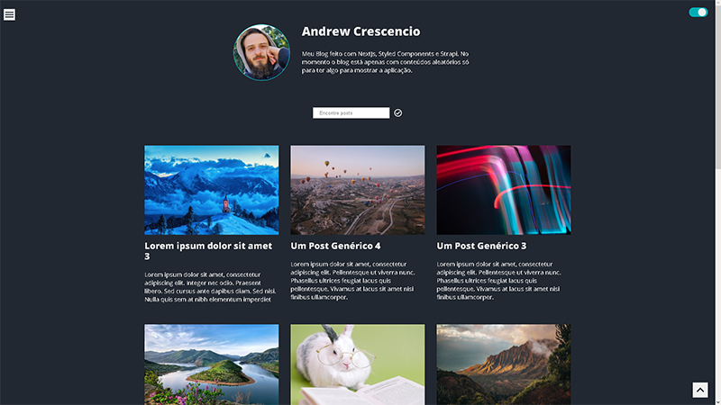

# Nextjs-Strapi-Blog

[Demo](https://andrew-blog-evgx4fxnz-andrewcrescencio.vercel.app) 

# :hammer_and_wrench: Tecnologias usadas:

[][tech_tools_anchor]
&nbsp;
[][tech_tools_anchor]
&nbsp;
[][tech_tools_anchor]
&nbsp;
[][tech_tools_anchor]
&nbsp;
[][tech_tools_anchor]
&nbsp;
[][tech_tools_anchor]
&nbsp;

Esta é uma aplicação de um blog.

O deploy do frontend foi feito na Vercel

O backend foi criado por meio do CMS Strapi, então todo o conteúdo pode ser facilmente alterado, e seu deploy foi feito na Heroku.

Você pode ter acesso ao Storybook desde projeto usando o comando `npm run storybook` caso baixe o projeto, mas [aqui](https://612497ba27789e003a207ef9-jxeuamaicm.chromatic.com) está o deploy feito no [Chomatic](https://www.chromatic.com)

[tech_tools_anchor]: #--
